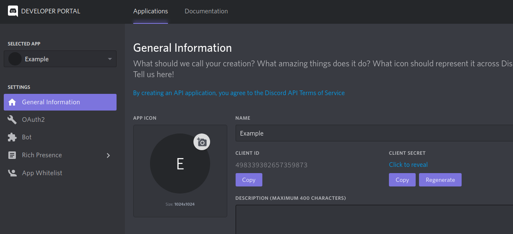

# Audios Discord Bot Template Setup

## ⬇️ Install

```
  npm install
```

or

```
 yarn
```

## ⚙️ Settings

### Default Commands

You can personalize the default commands in

```
  confing
         ↪️ defaultCommands.js
```

**Commands**

- **stay**: The bot stay in a voice channel
- **leave**: The bot leave a voice channel
- **help**: Send a private messave with all commands
- **addPermission**: Add permission to roles
- **removePermission**: Remove permission from roles
- **listPermissions**: List all roles with permission

### Default Messages

```
  confing
         ↪️ defaultMessages.js
```

**Messages**

- **busyMessage**: When the bot is busy in a voice channel
- **goToVoiceChannelMessage**: When the user isn't in a voice channel
- **permissionDeniedMessage**: When the user have not permission to user the commands
- **permissionAddMessage**: When the permission is added to a role
- **permissionRemoveMessage**: When the permission is removed from a role
- **listPermissionsMessage**: When list all roles with permission
- **nonePermissionMessage**: When the permission isn't restricted to any role
- **listenningMessage**: Message under the bot name

### Audios and Commands

Just place all audios files in the **audios** directory, the commands for the audios will be generated by the audio name.

You can places all audios in differents directories, will work in the same way.

### .env Example

```
  CLIENT_ID=YYYYYYYY
  TOKEN=XXXXXXXXX
```

## :nerd_face: Getting Client ID and Token values

1. Access: [Discord Developer Portal](https://discordapp.com/developers/applications/)

2. Create a new application or select a existent

3. In "General Informations" copy the **Client ID**



4. Go to "Bot" and add a new one


5. Copy the **Token** value


## :link: Getting the Bot URL

1. Go to "Bot", select the permissions and generated copy the number


```
https://discordapp.com/oauth2/authorize?client_id=[YOU CLIENT ID]&scope=bot&permissions=[YOUR PERMISSION CODE]
```

Access that URL to use your bot

## :haiti: Heroku tips
